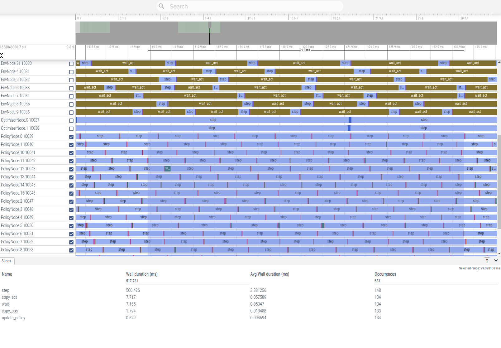
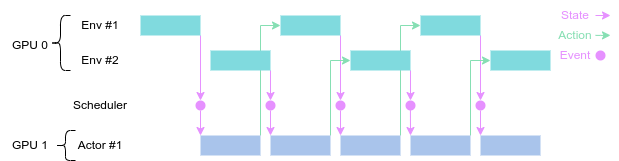
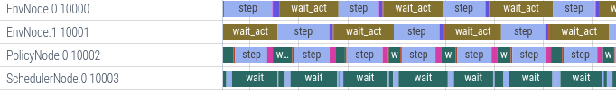
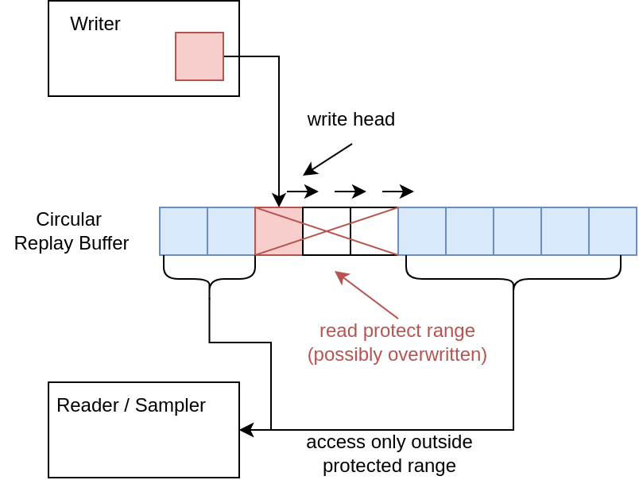

# OneRL
Event-driven fully distributed reinforcement learning framework proposed in "A Versatile and Efficient Reinforcement Learning Approach for Autonomous Driving" (https://arxiv.org/abs/2110.11573) that can facilitate highly efficient policy learning in a wide range of real-world RL-based applications.

- Super fast RL training! (15~30min for MuJoCo & Atari on single machine)
- State-of-the-art performance
- Scheduled and pipelined sample collection
- Completely lock-free execution
- Fully distributed architecture
- Full profiling & overhead identification tools 
- Online visualization & rendering
- Support multi-GPU parallel training
- Support exporting trained policy to ONNX for faster inference & deployment

## Installation

1. Clone this repo
```
git clone https://github.com/imoneoi/onerl.git
```
2. Install PyTorch and related dependencies (see requirements.txt)
```
pip install -r requirements.txt
```

## Quick Start

**MuJoCo benchmark**

(Any machine with a single GPU)

```shell
python -m onerl.nodes.launcher examples/config/1_gpu/mujoco_sac_<Env>.yaml
```

**Atari games**

(For 2 GPUs)
```shell
python -m onerl.nodes.launcher examples/config/2_gpu/atari_ddqn_<Env>.yaml
```

## Performance

## Configuration and Namespaces

Isolate nodes, $global

## Algorithm Settings

YAML format

## Custom Environments

OpenAI Gym interface

implement `reset`, `step`

## Custom Algorithms

```python
class RandomAlgorithm(Algorithm):
    def __init__(self,
                 network: dict,
                 env_params: dict,
                 **kwargs):
        super().__init__(network, env_params)
        # Initialize algorithm here

    def forward(self, obs: torch.Tensor, ticks: int) -> torch.Tensor:
        # Return selected action by observation (obs) at time (tick) as tensor

        if "act_n" in self.env_params:
            # discrete action space
            return torch.randint(0, self.env_params["act_n"], (obs.shape[0], ))
        else:
            # uniform -act_max ... act_max
            return self.env_params["act_max"] * (torch.rand(obs.shape[0], *self.env_params["act_shape"]) * 2 - 1)

    def learn(self, batch: BatchCuda, ticks: int) -> dict:
        # Update the policy using batch of transitions (s, a, r)_t

        return {}

    def policy_state_dict(self) -> OrderedDict:
        # Return the state dict (a dict of torch.parameters) of the actor
        # Which will be updated periodically to PolicyNode to interact with environment

        return OrderedDict()
```

## Export trained policy

## Profiling & Visualization

1. Enable profile recording

Set profiling=True and profile_log_path in global namespace

```yaml
$global:
  # Profiling
  profile: True
  profile_log_path: profile_log
```

2. Launch experiment, and profile will be recorded in meantime

```shell
python -m onerl.nodes.launcher <config_filename>
```


3. Convert to JSON format

```
python -m onerl.scripts.convert_profile profile_log/
```

4. Open JSON profile by Perfetto UI

Open https://ui.perfetto.dev in browser and drag & drop the converted JSON profile `profile.json`



## Distributed principles

### Pipeline execution with event-driven scheduling



In action:



### Lock-free replay sampling




## Citation
```
@inproceedings{
  wang2022a,
  title={A Versatile and Efficient Reinforcement Learning Approach for Autonomous Driving},
  author={Guan Wang and Haoyi Niu and Desheng Zhu and Jianming Hu and Xianyuan Zhan and Guyue Zhou},
  booktitle={NeurIPS 2022 Reinforcement Learning for Real Life Workshop},
  year={2022}
}
```
